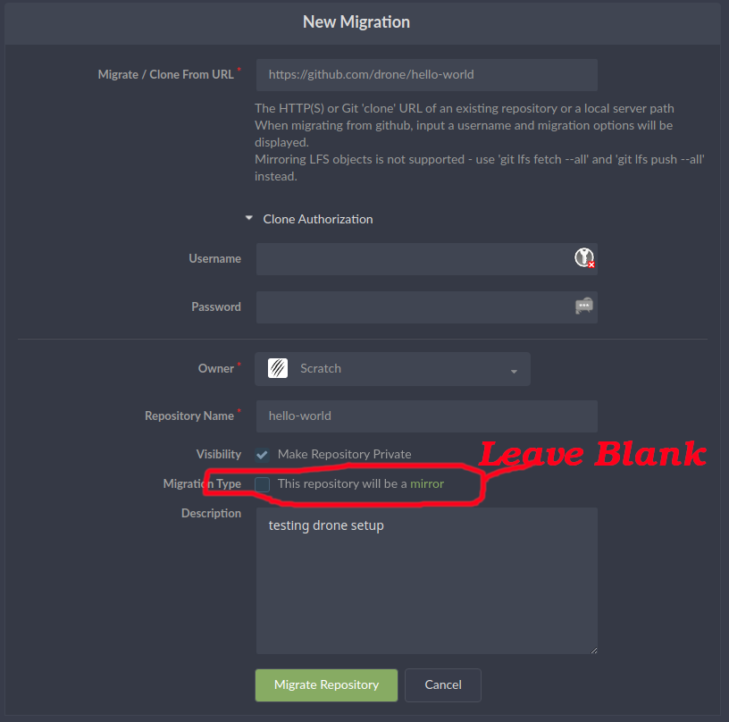
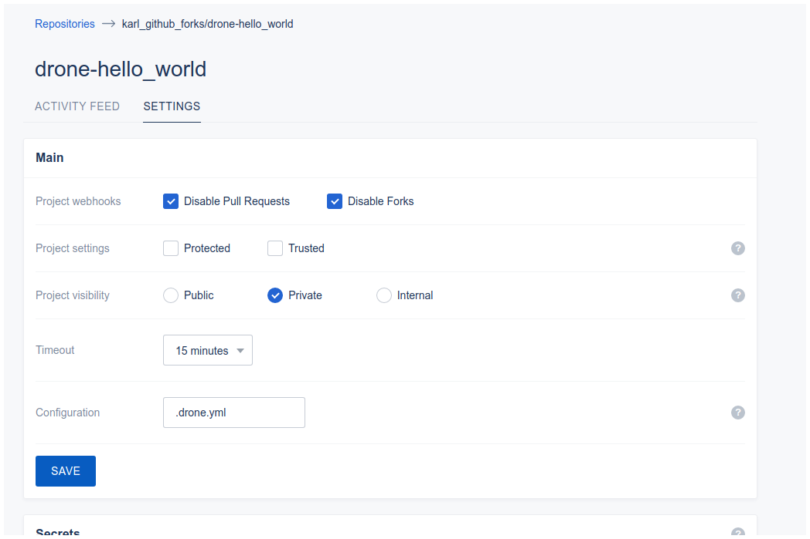
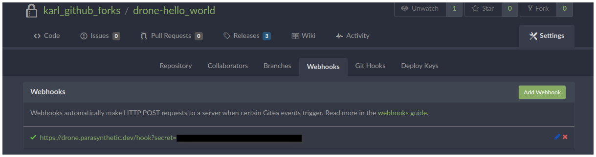
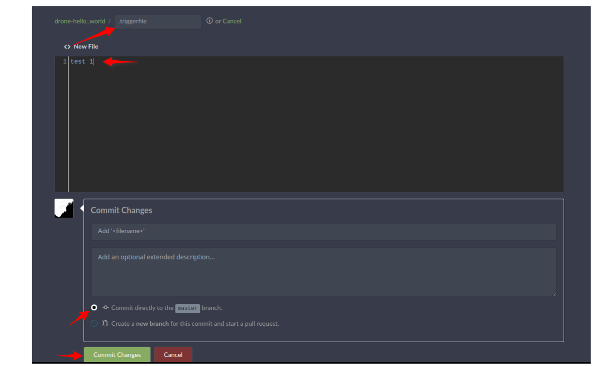
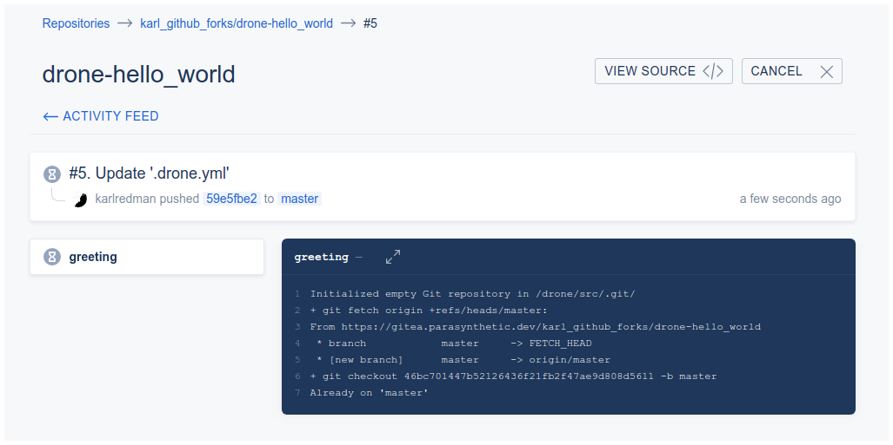
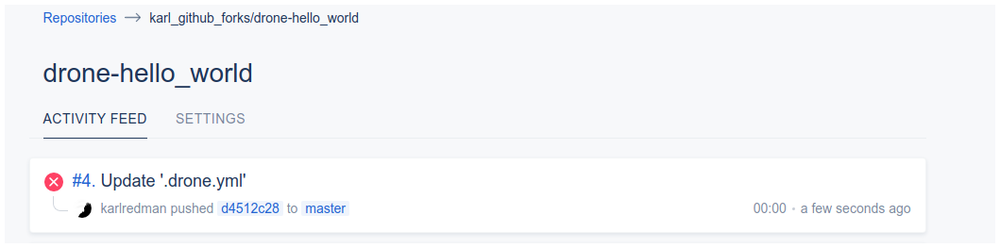
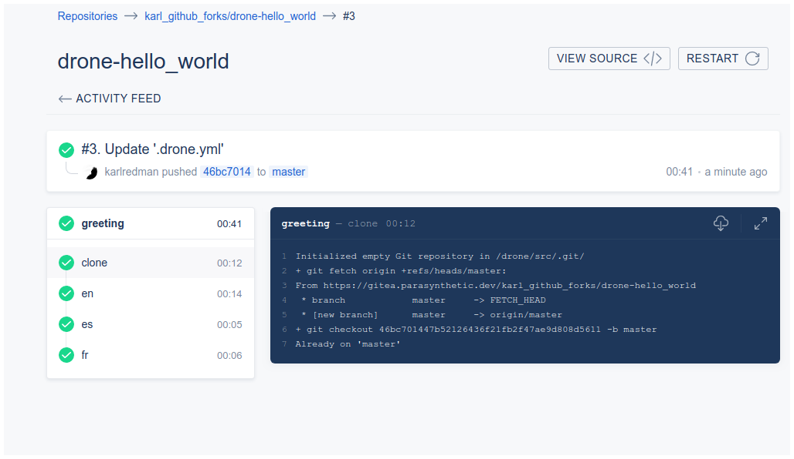

# Parasynthetic.dev drone/ci (v1.6.2) Setup:

Original document creation date: 10/01/2020

Parasynthetic.dev is an eccosystem of development tools that includes the following services:

* [Traefik](https://docs.traefik.io/v1.7/) (v1.7.11): Network Proxy server (and [Let's Encrypt](https://letsencrypt.org/docs/client-options/) ACME v2 client)
  * As of this writing Traefik v2+ is not entirely production ready IMHO.
* [Gitea](https://docs.gitea.io/en-us/) (v1.10.2): Private git repository
  * bare metal installation
  * uses Mysql on bare metal
* [Drone CI](https://drone.io/) (v1.6.2): Private build system instance
  * Docker based installation
  * uses Sqlite as database
* [Portus](http://port.us.org/) (v2.5.0): Private Docker image repository
  * Docker based installation
  * uses docker based (isolated) MariaDB database

Configuring drone is fairly straightforward once performed a few times. However, the project is under constant development and, hence, the documentation is hard to follow and often outdated. More often than not answers to critical configuration settings have to be researched across many forums -including reading current and past bug reports. Therefore, initial setup of a drone build system can be somewhat frustrating. Something to be mindful is that the licensing for Drone has changed a few times and may become restrictive to commercial entities relative to the use of Drone as a build system (see: [Licensing and Subscription FAQ](https://discourse.drone.io/t/licensing-and-subscription-faq/3839)).

## Special Notes:

* This document covers Drone Enterprise (with built in limitations mentioned in the FAQ) as defined by the license. Drone community edition is, essentially, useless out of the box for sustaining any kind of build system. See [Drone Enterprise Features](https://drone.io/enterprise/features/) for a comparison between the two versions.
* This document only covers the default [Docker Runner](https://docs.drone.io/installation/runners/docker/) pipelines. [Other runners](https://docs.drone.io/installation/runners/) are available and may be documented elsewhere or at a future date.
* This document assumes the use of fully qualified domain names (FQDN) whereby sub domains (i.e. service.example.com) are used and not subpaths (i.e. www.example.com/service).

### Network structure (with names used in the examples within this document):

* `localmachine` is the hostname of the localhost server that will be running Gitea and Drone services
* My network is configured like this:
  * See [Setup network and DNS with Docker VM's and web](:/8fe88ff3505241baa4c0c975aa36b1cb ) for more information
  * private nework (10.x.x.x) bound to an ethernet port
  * DNSMasq is running on the `localmachine` host and services the following networks:
	* DMZ 192.x.x.x from the router
	* the private network
	* the docker virtual network (named `localmachine.dockernet`)
  * [Træfik](https://docs.traefik.io/v1.7/)
  * your DNS server has been configured to accept the https://docker.example.com URI
    * I use a free account at [Cloudflare](https://www.cloudflare.com/) so I had to add my new URI to the DNS configuration page.

## Main Drone configuration knowledge resources:

* [Getting Started Introduction - CircleCI](https://circleci.com/docs/2.0/getting-started/#section=getting-started)
  * a general overview for using drone
* [CircleCI (Drone Enterprise/Cloud) Documentation - CircleCI](https://circleci.com/docs/)
* [Github:drone/drone-cli: Drone CLI](https://github.com/drone/drone-cli)
* [Drone Discourse Channel](https://discourse.drone.io/)
* [Woodpecker Project](https://woodpecker.laszlo.cloud/)
  * an OSS project fork of Drone v0.8

## Setting up Drone for Gitea

The documentation is decient for most of this part of the configuration. This section is meant to be suplimental to the documention references below. I skip several sections of the original documentation so that we can move straight to implementing a `docker-compose` method of instantiation. Once the drone service is actually running and you have logged in please move on to [Testing the Drone Installation](#testing-the-drone-installation).

* References:
  * [Gitea with Drone installation](https://docs.drone.io/installation/providers/gitea/)
    * Drone documentation for installing
    * copy of original page: [Gitea | Drone _cpy_](:/26a009d24cb94284bb0184f13284687a)
      * copied from: [Gitea | Drone](https://docs.drone.io/installation/providers/gitea/)
  * [Drone Variables Definitions](https://docs.tea-ci.org/usage/variables/)
  * [How to pull private images with 1.0 - faq ](https://discourse.drone.io/t/how-to-pull-private-images-with-1-0/3155)
    * generalized and sparse information for pulling docker images from a private registry (i.e. via Portus)
    * supplementary information: [Docker Credential Storage](https://www.projectatomic.io/blog/2016/03/docker-credentials-store/)

### Step 1 - Preperation

* Create OAuth application credentials in Gitea

  1. Login to Gitea as user with appropriat permissions to creat application credentials
  2. Navigate to `settings->Applications: Manage OAuth Applications`
  3. Create Application (use appropriat values):
    * Application Name: `gitea-drone`
    * Redirect URI: `https://drone.example.com/login`
      * Note: the callback URL **must match** the above format where `login` is a subpath of the URI

* Create a shared secret for `Runners`

This is the secret that will be used to authenticate between the Drone Agent and the docker instances that will actually perform the work of building projects.

```
$ openssl rand -hex 16 # copy the output similar to the example below
bea26a2221fd8090ea38720fc445eca6
```

* Make sure the user has has webhooks/git-hooks privledges in Gitea
  * as administrator: `system settings -> users -> [select the user] -> May Create Git Hooks:enabled`

### Step 2 - Download

Skip this for now. We're going to setup `docker-compose` instead.

If you must use this:

**Note:** The difference in version numbers below is **not** a typo. As of 10/01/2020 these were the stable versions that are supposed to work together.

```
docker pull drone/drone:1.6.4
docker pull drone/agent:1.6.2

```

### Step 3 - Configuration

Familiarize yourself with these configuration settings. Well use them for our `docker-compose.yml` file later

### Step 4 - Start the Server:

Skip this step in favor of the next major section for setting up docker compose.

### Step 5 - Install Runners

Skip this step for now. For basic configurations we don't need to bother with this. The Drone Agent will manage the pull from dockerhub as needed.

## Configure Docker Compose

My settings are as follows. At this stage It's probably just best to study the configuration and begin experimenting with starting the containers via `docker-compose up`. Please refer to the documentation references cited earlier in this document for more information.

`.env` file:

```
RESTART=always
SERVER_IMAGE_TAG=1.6.4
AGENT_IMAGE_TAG=1.6.2
SERVICE_NAME=drone
SERVICE_DOMAIN=example.com
DOCKER_NETWORK=localmachine.dockernet
SERVICE_DATA_DIR=/var/lib/drone/gitea

### multi-machine

#### server settings
DRONE_SERVER_PROTO=https
DRONE_TLS_AUTOCERT=false
# set true if git server runs in private mode (i.e. github enterprise private mode)
# ref: [Enabling private mode - GitHub Help](https://help.github.com/en/enterprise/2.14/admin/installation/enabling-private-mode)
DRONE_GIT_ALWAYS_AUTH=true
DRONE_RUNNER_CAPACITY=2
DRONE_RUNNER_NAME=scyld

##### service settings
DRONE_AGENTS_ENABLED=true
############ CHANGE THIS!
DRONE_RPC_SECRET=bea26a2221fd8090ea38720fc445eca6

#### registration settings
# admin user
# ref: [DRONE_USER_CREATE](https://docs.drone.io/reference/server/drone-user-create/)
DRONE_USER_CREATE=username:karlredman,admin:true
#
# user / organization white list
# ref: [User Registration](https://docs.drone.io/administration/user/registration/)
DRONE_USER_FILTER=karlredman

#### github settings - CHANGE THESE!
DRONE_GITEA_CLIENT_ID=XXXXXXXX-XXXX-XXXX-XXXX-XXXXXXXXXXXX
DRONE_GITEA_CLIENT_SECRET=XXXXXXXXXXXXXXXXXXXXXXXXXXXXXXXXXXXXXXXXXXX=
DRONE_GITEA_SERVER=https://gitea.example.com
```

`docker-compose.yml` file:

```
version: '3.7'

services:
  drone-server:
    image: drone/drone:${SERVER_IMAGE_TAG}
    volumes:
      - ${SERVICE_DATA_DIR}:/data
      - /var/run/docker.sock:/var/run/docker.sock
    restart: ${RESTART}
    labels:
      - "traefik.enable=true"
      - "traefik.port=80"
      - "traefik.frontend.rule=Host:${SERVICE_NAME}.${SERVICE_DOMAIN}"
    environment:
      # Server settings
      - DRONE_SERVER_PROTO=${DRONE_SERVER_PROTO}
      - DRONE_TLS_AUTOCERT=${DRONE_TLS_AUTOCERT}
      - DRONE_GIT_ALWAYS_AUTH=${DRONE_GIT_ALWAYS_AUTH}
      # Service settings
      - DRONE_SERVER_HOST=${SERVICE_NAME}.${SERVICE_DOMAIN}
      - DRONE_AGENTS_ENABLED=${DRONE_AGENTS_ENABLED}
      - DRONE_RPC_SECRET=${DRONE_RPC_SECRET}
      # Registration settings
      - DRONE_USER_CREATE=${DRONE_USER_CREATE}
      - DRONE_USER_FILTER=${DRONE_USER_FILTER}
      # Gitea Settings
      - DRONE_GITEA_CLIENT_ID=${DRONE_GITEA_CLIENT_ID}
      - DRONE_GITEA_CLIENT_SECRET=${DRONE_GITEA_CLIENT_SECRET}
      - DRONE_GITEA_SERVER=${DRONE_GITEA_SERVER}
    networks:
      - traefik.bridge

  drone-agent:
    image: drone/agent:${AGENT_IMAGE_TAG}
    restart: ${RESTART}
    depends_on:
      - drone-server
    volumes:
      - /var/run/docker.sock:/var/run/docker.sock
    environment:
      - DRONE_RUNNER_NAME=${DRONE_RUNNER_NAME}
      - DRONE_RUNNER_CAPACITY=${DRONE_RUNNER_CAPACITY}
      - DRONE_RPC_SERVER=${DRONE_SERVER_PROTO}://${SERVICE_NAME}.${SERVICE_DOMAIN}
      - DRONE_RPC_SECRET=${DRONE_RPC_SECRET}
    networks:
      - traefik.bridge

networks:
  traefik.bridge:
    external:
      name: "${DOCKER_NETWORK}"
```

### What to expect when accessing your `https://drone.example.com` URI:

#### Configuration Summary (Post Install)

So far we've setup Drone and started the service with the following in mind:

* Gitea has been configured to allow access from the Drone servive by way of an OAuth Application Client ID and Secret.
  * Variables:
      * `DRONE_GITEA_CLIENT_ID=${DRONE_GITEA_CLIENT_ID}`
      * `DRONE_GITEA_CLIENT_SECRET=${DRONE_GITEA_CLIENT_SECRET}`
* We have configured our Drone `docker-compose.yml` so that `Traefik` is aware of the service.
  * Variables:
      * `traefik.enable=true`
		* allow Traefik to manage the web connection
      * `traefik.port=80`
		* this is the internal (docker network) port used by Drone
		* this could be made more secure with a localized certificate authority and forcing drone to communcate using SSL/TLS protocols.
		* Traefik manages the communication as a proxy server so the Drone port 80 is never exposed outside the docker virtual network.
		* see [Container networking | Docker Documentation](https://docs.docker.com/config/containers/container-networking/) for more information.
      * `traefik.frontend.rule=Host:${SERVICE_NAME}.${SERVICE_DOMAIN}`
		* this tells Traefik what the FQDN looks like so it can route to/from the Drone service and the interwebs.
* We have specified that network routing between the Traefik proxy server and the Drone container occurs over an virtual network (managed by docker).
```
networks:
  traefik.bridge:
    external:
      name: "${DOCKER_NETWORK}"
```

#### Logging into Drone

1. Point your browser toward your drone server: [https://drone.example.com](https://drone.example.com)
2. Traefik will route your DNS request to Drone, which, in turn, will redirect to a Gitea login page for authentication.
3. Login as the Gitea user for which the OAuth Application credentions were obtained earlier.
4. Once logged you should be redirected to the `drone.example.com` landing page.
  * If all is well the drone page will be populating a list of your repositories
  * Wait for a while until your repos have been read -otherwise drone may throw an error
5. Attempt to activate a repository: this will indicate that you are enabling a webhook for that repository
  * Again, if you attempt to activate a repository too soon on a new login you may receive an error.
  * You can verify that a webhook was made by vising the Gitea settings for the repository you are attempting to activate:
    * As the normal user in Gitea: `[choose your repository] -> settings -> webhooks`

## Testing the Drone Installation

* For testing purposes it's easiest to just use [drone/hello-world: simple repository with CI enabled](https://github.com/drone/hello-world).
  * Use Gitea's migrate feature to create a local copy of the `hello-world` repo from github.



* navigate to your drone service (`https://drone.example.com`) and refresh/sync the repoitory list if needed.
  * activate the hello-world repository



* verify that the webhook was created for the repository in Gitea
  * `settings -> webhooks`




* Add a file named `.trigerfile` to the repository root and save.



* Check the drone activity page
  * This build will timeout because of the `node: build` section at the bottom of `.drone.yml`
  * Note, as of this writing there is an incompatibility with the current `.drone.yml` file.

  ```
  # causes hello-world build to fail
  node:
    build
  ```




* Remove the last two lines (shown below) of the `.drone.yml` file and save again
  * This will start a new build that will succeed




## Pulling a Docker Image from a Private Docker Registry

Drone requires a specific configuration in order to authenticate against a password protected docker registry. Pulling from a private docker registry does not require any other configuration beyond the methods outlined in this section. Various documentation seems to indicate that the build be designated as `Trusted`, for instance, but this is not the case. Similarly, `Allow Pull Requests` is not required to be enabled in the secrets section either.


### JSON method

This method uses a secret, specifically named `dockerconfigjson` with content in the pattern of the docker authentication file, `$HOME/.docker/config.json` after a normal login.

* The docker authentication JSON file `auth` field is a hash

```
echo -n 'username:password' | base64
```

* The JSON contents look like this:

```
{
	"auths": {
		"https://index.docker.io/v1/": {
			"auth": "YW11cmRhY2E6c3VwZXJzZWNyZXRwYXNzd29yZA=="
		}
	}
}

```

* A correct JSON blob from a docker login would look like this:

```
# login to private docker registry from the command line
docker login -u karlredman https://docker.parasynthetic.dev

# contents of `$HOME/.docker/config.json` after login
cat `$HOME/.docker/config.json`
{
  "auths": {
          "docker.parasynthetic.dev": {
                  "auth": "XXXXXXXXXXXXXXXXXXXXXXXXXXXXXXXXXXXXXXXXXXXXXXXXXXXXXXXXXXXXXXXXx"
          }
  },
  "HttpHeaders": {
          "User-Agent": "Docker-Client/18.09.1 (linux)"
  }
}
```

* A script for the JSON content might look like this

```
cat <<EOF >> dockerconfigjson
{
	"auths": {
		"https://index.docker.io/v1/": {
			"auth": "$(base64 --input=credfile)"
		}
	}
}
EOF
```

#### setting the `dockerconfigjson` drone secret

##### Prepare the `.drone.yml` file

* Add the appropriate declaration near the end of the file after the build section.

```
.
.
.
image_pull_secrets:
- dockerconfigjson
```

##### Using the drone UI:

Select `settings` for the desired repository and create a secret.

  * name: dockerconfigjson
  * secret: <contents of the JSON data outlined earlier>

##### Using `drone` -command line tool- to set the secret.

```
source /home/karl/Scratch/drone_vars && sudo -E bash -c 'drone secret add --repository Parasynthetic/drone_portus_test --name dockerconfigjson --data @/home/karl/.docker/config.json'
#
# alternate form (without sudo)
source /home/karl/Scratch/drone_vars && drone secret add --repository Parasynthetic/drone_portus_test --name dockerconfigjson --data @/home/karl/.docker/config.json
```

* where `/home/karl/Scratch/drone_vars` contains the drone service credentials
```
export DRONE_SERVER=https://drone.parasynthetic.dev
export DRONE_TOKEN=XXXXXXXXXXXXXXXXXXXXXXXXXXXXXXXX
# drone info # use this command to test your credentials from command line
# another example:
# source /home/karl/Scratch/drone_vars && sudo -E bash -c 'drone info'
```

#### Drone CLI Builds
* Note that using a *secrets file* with `drone exec` does not work for drone <= v1.6.2 when using `image_pull_secrets`. You must set the secret and then run `drone exec` seperately
  * `drone exec` can't pull images from a private repository.
  * Note: we use `sudo -E bash -c` so that the `drone` command can access the docker socket
  * Reminder: docker exec must be run from a machine that has access to the images
  * The work around is to **manually pull** the images before running `drone exec`
    * see: [Howto drone exec private docker registry (drone 1.1)](https://discourse.drone.io/t/howto-drone-exec-private-docker-registry-drone-1-1/4633)

```
# this won't work - `--secret-file` is only for variables used with `from_secre:t`
source /home/karl/Scratch/drone_vars && sudo -E bash -c 'drone exec --secret-file=/home/karl/Scratch/secretsfile'
```

### The `.drone.yml` file would look like this:

```
kind: pipeline
name: default

steps:

- name: test
  image: docker.parasynthetic.dev/karlredman/flask-base:latest
  pull: if-not-exists
  # pull: always
  # pull: if-not-exists
  # pull: never
  commands:
    - ./test.sh 3.5.3
    - ./test.sh 3.6.8
    - ./test.sh 3.7.2

image_pull_secrets:
- dockerconfigjson
```

## User Name and Password Method

I have never gotten this method to work. There is some documentation about this but the methods are either outdated or I'm doing something wrong.

* see: [Using Private Images - CircleCI](https://circleci.com/docs/2.0/private-images/)

